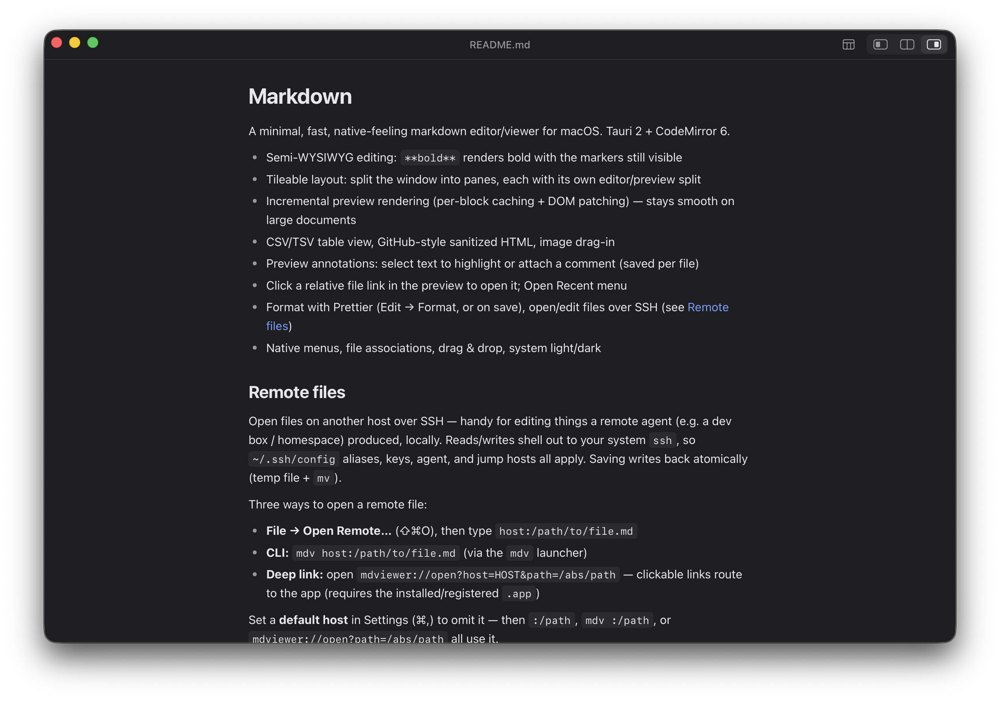
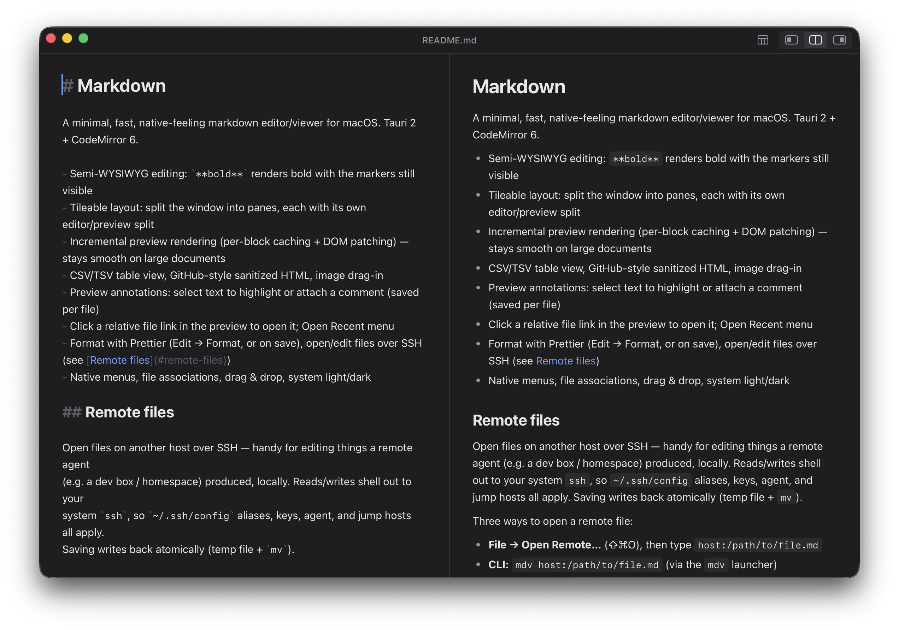

# md-viewer

A minimal, fast, native-feeling markdown editor/viewer for macOS. Tauri 2 + CodeMirror 6.





- Semi-WYSIWYG editing: `**bold**` renders bold with the markers still visible
- Tileable layout: split the window into panes, each with its own editor/preview split
- Incremental preview rendering (per-block caching + DOM patching) — stays smooth on large documents
- CSV/TSV table view, GitHub-style sanitized HTML, image drag-in
- Preview annotations: select text to highlight or attach a comment (saved per file)
- Click a relative file link in the preview to open it; Open Recent menu
- Format with Prettier (Edit → Format, or on save), open/edit files over SSH (see [Remote files](#remote-files))
- Native menus, file associations, drag & drop, system light/dark

## Remote files

Open files on another host over SSH — handy for editing things a remote agent
(e.g. a dev box / homespace) produced, locally. Reads/writes shell out to your
system `ssh`, so `~/.ssh/config` aliases, keys, agent, and jump hosts all apply.
Saving writes back atomically (temp file + `mv`).

Three ways to open a remote file:

- **File → Open Remote…** (⇧⌘O), then type `host:/path/to/file.md`
- **CLI:** `mdv host:/path/to/file.md` (via the `mdv` launcher)
- **Deep link:** open `mdviewer://open?host=HOST&path=/abs/path` — clickable
  links route to the app (requires the installed/registered `.app`)

Set a **default host** in Settings (⌘,) to omit it — then `:/path`,
`mdv :/path`, or `mdviewer://open?path=/abs/path` all use it.

For an agent on the remote box to hand you an openable link, have it print the
absolute path and either form:

```
mdviewer://open?host=<your-ssh-alias>&path=/abs/path/to/file.md
# or, if a default host is set:
mdv :/abs/path/to/file.md
```

## Develop

```sh
bun install
bun run tauri dev
```

## Build

```sh
bun run tauri build
# → src-tauri/target/release/bundle/macos/Markdown.app
```

## CLI launcher (`mdv`)

`scripts/mdv` runs the compiler-built release binary directly (building it from
source on first use), which avoids binary-authorization tools (e.g. Santa) that
block unsigned `.app` bundles but allow locally compiled binaries. Put it on
your `PATH`:

```sh
ln -s "$PWD/scripts/mdv" ~/bin/mdv      # or copy it into your dotfiles' bin/
mdv notes.md                            # open a local file
mdv coder.box:/home/me/plan.md          # open over SSH
```

Override the source location with `MDV_DIR`; force a rebuild with `mdv --rebuild`.

## Shortcuts

| Action | Keys |
| --- | --- |
| Settings | ⌘, |
| New / Open / Save / Save As | ⌘N / ⌘O / ⌘S / ⇧⌘S |
| Open Remote… | ⇧⌘O |
| Export as HTML… | ⇧⌘E |
| Toggle outline | ⌃⌘O |
| Editor · Split · Preview | ⌘1 · ⌘2 · ⌘3 |
| Paste and match style | ⇧⌘V |
| New pane right / below | ⌘D / ⇧⌘D |
| Close pane | ⌘W |
| Next / previous pane | ⌃Tab / ⌃⇧Tab |
| Zoom in / out / reset | ⌘+ / ⌘− / ⌘0 |
| Bold / Italic / Code / Strike / Link | ⌘B / ⌘I / ⌘E / ⇧⌘X / ⌘K |
| Toggle task checkbox | ⌘↩ |
| Format document | ⇧⌥F |
| Next / previous table cell | Tab / ⇧Tab |

All shortcuts are rebindable in Settings (⌘,).
